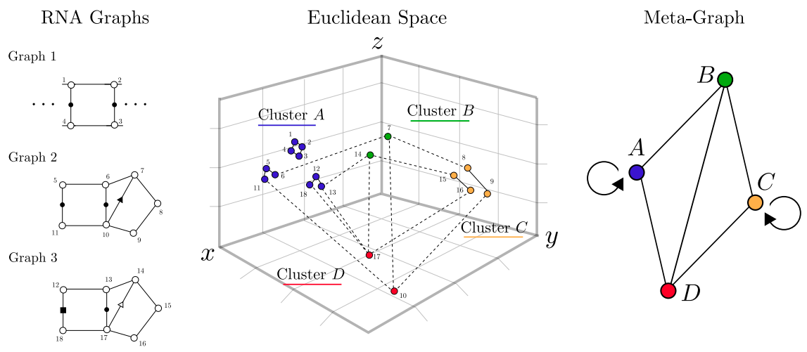

# vernal: Fuzzy Recurrent Subgraph Mining




This is a reference implementation of `veRNAl`, an algorithm for identifying fuzzy recurrent subgraphs in RNA 3D networks.

Please cite:

```
@article{oliver2020vernal,
  title={VeRNAl: A Tool for Mining Fuzzy Network Motifs in RNA},
  author={Oliver, Carlos and Mallet, Vincent and Philippopoulos, Pericles and Hamilton, William L and Waldispuhl, Jerome},
  journal={arXiv preprint arXiv:2009.00664},
  year={2020}
}
```

See [full paper](https://arxiv.org/abs/2009.00664) for complete description of the algorithm.

You can browse the results from an already trained model [here](http://vernal.cs.mcgill.ca/).


This repository has three main components:

* Preparing Data `/prepare_data`
* Subgraph Embeddings `/train_embeddings`
* Motif Building `/build_motifs`

Each subdirectory contrains a `main.py` file which controls the behaviour of that stage.
For full usage, run `python <dir>/main.py -h`

## 0. Install Dependencies

The command below will install the full list of dependencies.

The main packages we use are:

* multiset
* NetworkX 
* BioPython
* Pytorch
* DGL (Deep Graph Library)
* Scikit-learn

```
conda env create -f environment.yml
conda activate vernal
```

## 1. Data Preparation

This step loads the whole PDBs, creates uniformly-sized chunks (`chopper.py`) and builds
newtorkx graphs for each chunk.

We build a rooted subgraph and graphlet hashtable for each node in `annotate.py` to
speed up the similarity function computations at training time.

Create two directories where the data will be kept:

```
mkdir data/graphs
mkdir data/annotated
```

Data building and loading will take some time (~1 hr), you can skip all the data preparation if you want to use a [pre-built dataset](https://mega.nz/file/pCJGUIQA#Z6pNGjrk-TCC27aUeWhEcjLjGtlrs46D61PNRT2WeZ0), just download and move to the `data/annotated/` folder and move to step 2.

Download RNA networks:

* [whole crystal structures (non-redundant)](https://mega.nz/file/lLpxjBJA#2H837fqO7VsVnLWpfT0bo4i04lFTeYSul5N_mY8pJW0)
* [whole graphs (non-redundant)](https://mega.nz/file/YWIHEQxQ#qRUCL8X9eV6NtViXgkZI1lOBlCfc_cWokvMgN-XB9B0)

Save the crystal structures (first link) to the `data/` folder.

Save the whole graphs (second link) to the `data/graphs` folder.

Bulid the dataset. This will take some time as it involves loading many large PDB files.


```
python prepare_data/main.py -n <data-id>
```

## 2. Subgraph Embeddings

Once the training data is built, we train the RGCN.

```
python train_embedding/main.py train -n my_model
```

## 3. Motif Building

Finally, the trained RGCN and the whole graphs are used to build motifs.


Here, you have three options:

1. Build/load a new meta graph
2. Use a meta graph to build motifs
3. Use a meta graph to search for matches to a graph query

To build a new meta graph: 

If this is the first time you build a meta-graph, create the following folder:

```
mkdir results/mggs
```

```
python build_motifs/main.py -r my_model --mgg_name my_metagraph
```

The new meta-graph will be built and dumped in the folder `results/mggs/my_metagraph.p`
