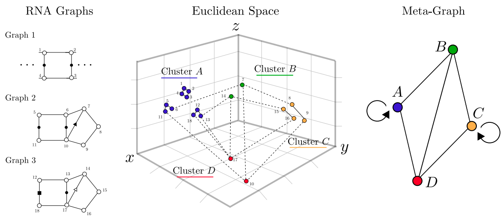
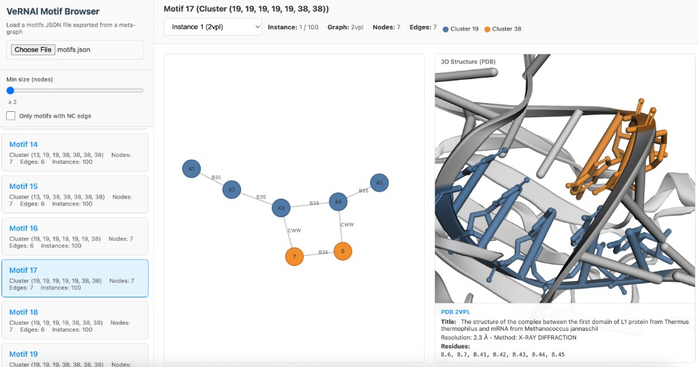

# vernal: Fuzzy Recurrent Subgraph Mining




This is a reference implementation of `veRNAl`, an algorithm for identifying fuzzy recurrent subgraphs in RNA 3D networks.

Please cite:

```
@article{vernal,
    author = {Oliver, Carlos and Mallet, Vincent and Philippopoulos, Pericles and Hamilton, William L and Waldispühl, Jérôme},
    title = "{VeRNAl: A Tool for Mining Fuzzy Network Motifs in RNA}",
    journal = {Bioinformatics},
    year = {2021},
    month = {11},
    issn = {1367-4803},
    doi = {10.1093/bioinformatics/btab768},
    url = {https://doi.org/10.1093/bioinformatics/btab768},
    note = {btab768},
    eprint = {https://academic.oup.com/bioinformatics/advance-article-pdf/doi/10.1093/bioinformatics/btab768/41153095/btab768.pdf},
}
```

**Motif data as a CSV is available on Zenodo: https://zenodo.org/records/17087809**

See [full paper](https://academic.oup.com/bioinformatics/article/38/4/970/6428528?login=true) for complete description of the algorithm.

You can browse the results from an already trained model [here](http://vernal.cs.mcgill.ca/).

This repository has three main components:

* Preparing Data `/prepare_data`
* Subgraph Embeddings `/train_embeddings`
* Motif Building `/build_motifs`

Each subdirectory contrains a `main.py` file which controls the behaviour of that stage.
For full usage, run `python <dir>/main.py -h`

## 0. Install Dependencies

**Recommended:** Use the virtualenv in `.venv`:

```
python -m venv .venv
source .venv/bin/activate   # On Windows: .venv\Scripts\activate
pip install -r requirements.txt
```

Alternatively, use conda:

```
conda env create -f environment.yml
conda activate vernal
```

The main packages we use are:

* multiset
* NetworkX (>=3.0)
* BioPython
* PyTorch (>=2.0)
* DGL (Deep Graph Library, >=2.0)
* Scikit-learn

## 1. Data Preparation

This step loads RNA structures, creates uniformly-sized chunks (`chopper.py`) and builds
networkx graphs for each chunk.

We build a rooted subgraph and graphlet hashtable for each node in `annotate.py` to
speed up the similarity function computations at training time.

### Option A: Use rnaglib (recommended)

Data is now available via the [rnaglib](https://rnaglib.org) Python package, which provides
RNA 2.5D graphs and crystal structures from Zenodo. This replaces the previous MEGA links.

```
python prepare_data/main.py -n rnaglib_nr --source rnaglib
```

This will:
1. Download the non-redundant RNA dataset from rnaglib (~/.rnaglib)
2. Download mmCIF structures from the PDB
3. Convert graphs to vernal format and run the full preprocessing pipeline

The first run may take 30-60 minutes (download + processing).

### Option B: Manual setup

Create directories and use your own data:

```
mkdir -p data/graphs data/annotated
```

Place whole graphs (`.nx` format) in `data/graphs/<graph_dir>/` and mmCIF structures in `data/<pdb_dir>/`. Then:

```
python prepare_data/main.py -n <data-id> -g <graph_dir> -da <pdb_dir>
```

## 2. Subgraph Embeddings

Once the training data is built, we train the RGCN.

```
python train_embeddings/main.py train -n my_model -da rnaglib_nr
```

Use `-da <data-id>` to match the name from step 1 (e.g. `rnaglib_nr` if you used `--source rnaglib`).

## 3. Motif Building

Finally, the trained RGCN and the whole graphs are used to build motifs.

You have three options:

1. Build/load a new meta graph
2. Use a meta graph to build motifs
3. Use a meta graph to search for matches to a graph query

To build a new meta-graph and motifs (using data from steps 1-2):

```
mkdir -p results/mggs
python build_motifs/main.py -r my_model --mgg_name my_metagraph -b
```

- `-r my_model`: trained model from step 2
- `--mgg_name my_metagraph`: output meta-graph name
- `-b`: build motifs from the meta-graph

By default, graphs are loaded from rnaglib's RNADataset (no prepare_data conversion needed). To use local `.nx` files instead, pass `-g`:

```
python build_motifs/main.py -r my_model -g data/graphs/rnaglib_nr_whole --mgg_name my_metagraph -b
```

The meta-graph and motifs will be built and dumped in `results/mggs/my_metagraph.p`.

### Motif Viewer

The motif building step automatically exports the meta-graph to JSON in `results/mggs/my_metagraph.json`. Open `visualize_motifs.html` in a browser and load that JSON file to view motifs.



To export manually (e.g. with different options):

```bash
python tools/export_metagraph.py results/mggs/my_metagraph.p -o motifs.json --max-instances 10
```
